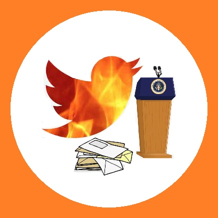

# LarryOnBallots
The goal of the project is to divide Switzerland municipality-level census data combined with past municipality-level referendum results into training and testing datasets and apply different machine learning models to identify demographic feature trends in referendum voting outcomes. Additionally, this project will attempt to predict referendum outcomes with machine learning models trained with data from a politically similar referendum. An example of politically similar referendums is the 2021 approved referendum to ban full-face coverings (including the burka) in public and the 2009 approved referendum to ban the construction of mosque minarets.

Main content: 
- /data
    - demographics_2021.csv : demographic data
    - face_covering.csv : referendum results data
- /resources
    - data_preprocessing.py : loading and merging of data
- /models
    - model_evaluation.ipynb : evaluation analysis with all relevant features
    - model_evaluation_no_pp.ipynb : evaluation analysis with no political data
- /plots
- /submissions
